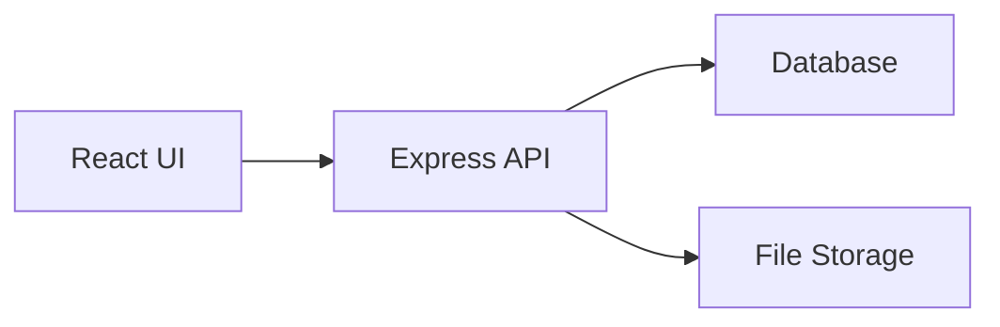

# Document Management System Plan

## Goals
- Implement MC and Section workflows, including control-number generation, role-based access, file uploads, and exports.
- Provide two deployment options: online (cloud) and offline (single-machine or LAN) with no budget.

## Requirements Summary
### Sections
- Sections: INVES, INTEL, ADM, OPN.
- MC controls all sections; Section users access only their section.

### Form Fields and Rules
- MC Ctrl No: `RFU4A-MC-YYMMDD-NO` generated by MC when creating a master list entry.
- Section Ctrl No: `RFU4A-SECTION-YYMMDD-NO` generated upon MC creation for the selected section.
- Section: dropdown.
- Date Received: calendar.
- Subject: user input + document upload; clicking subject opens file link.
- From: default based on section; editable via dropdown; if User Input selected, user enters custom value.
- Target Date: user chooses date picker or manual input.
- Received By: defaults per section; dropdown if multiple personnel in section.
- Action Taken: dropdown (Drafted, Disseminated, Filed).
- Remarks: checkbox (Email, Viber, Hard Copy) and formatted output Sent Through A / B / C.
- Concerned Units: same options as From.
- Date Sent: calendar.

### Export
- Export format: Excel only.
- Subject column is a hyperlink to the uploaded file.
- Uploads: PDF/DOCX.
- Max file size: >10MB.
- Control-number reset rule: no reset; continuous update.

## Data Model
### User
- id, username, passwordHash
- role: MC or SECTION
- section: INVES, INTEL, ADM, OPN

### DocumentRecord
- id, mcCtrlNo, sectionCtrlNo, section
- dateReceived, subjectText, subjectFileUrl
- fromValue, fromType
- targetDate, targetDateMode
- receivedBy
- actionTaken
- remarks: [email, viber, hardCopy]
- concernedUnits, dateSent
- createdBy, updatedBy, createdAt, updatedAt

### ControlNumberCounter
- id, scope: MC or SECTION
- section (nullable for MC)
- currentNumber
- lastDateUsed (kept for audit even if no reset)

### AuditLog
- id, actorId, action, entityType, entityId, before, after, timestamp

## Auth and Permissions
- MC: CRUD all sections, create master list entries, generate both control numbers, export all.
- Section: CRUD only own section records, upload files, export own section.
- Login credentials mapped to usernames listed in requirements.

## API Endpoints
- POST /auth/login
- POST /auth/logout
- GET /users/me
- GET /sections

- POST /records
- GET /records
- GET /records/{id}
- PUT /records/{id}
- DELETE /records/{id}

- POST /records/{id}/upload
- GET /records/{id}/download

- POST /export
- GET /export/{jobId}

- POST /control-numbers/next

## Deployment Options
### Online Plan
- Frontend: React app.
- Backend: Node.js + Express API.
- Database: PostgreSQL using free tier service.
- Storage: object storage free tier or database-backed file storage for PDF/DOCX.
- Pros: accessible anywhere, centralized data, easy to manage users.

### Offline Plan
- Single machine or LAN host.
- Backend: Node.js + Express.
- Database: SQLite file on local machine.
- Storage: local file system directory for uploads.
- Optional: packaged desktop app using Electron to avoid needing a separate server install.
- Pros: no internet required, simple deployment, low cost.

## UI/UX Updates
- Login with role mapping.
- MC dashboard with Add Ctrl No flow: date picker + section dropdown + submit.
- Section dashboard: only own tab enabled; other tabs locked.
- Form panel updated with all required fields and dropdowns.
- Filters: section, status, date range.
- Export to Excel button with hyperlink subject column.

## Implementation Milestones
- Schema and migrations for users, records, counters, audit log.
- Auth + RBAC middleware.
- CRUD + file uploads + export flow.
- UI wiring for role-based dashboards and form fields.
- Tests for control-number generation, RBAC, export hyperlinks.

## Architecture Diagram

